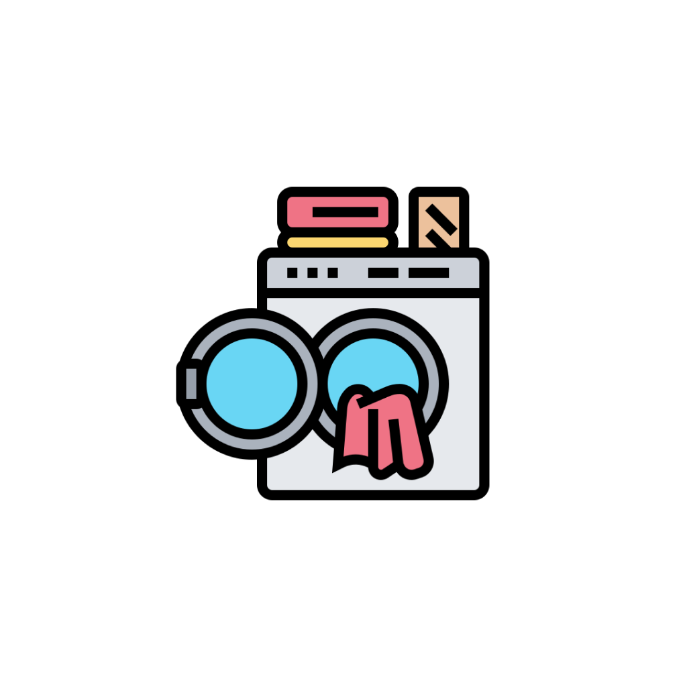

# LaundryEase

<p align="left">
  
</p>

LaundryEase is a convenient and user-friendly laundry application built with React Native, Firebase integration, Lottie animations, and more. This app simplifies the laundry process, providing features like sign-in, sign-up, profile management, intuitive item selection with a user-friendly cart system, pickup details, order placement, and even a location tracker.

## Features

- **Firebase Integration:** Secure sign-in and sign-up functionality using Firebase authentication.
- **Profile Section:** Users can manage their profiles within the app.
- **Laundry Items:** A variety of laundry items such as shirts, dresses, etc., can be selected and added to the cart.
- **Intuitive Cart System:** Easy-to-use UI for adding items to the cart along with quantity adjustments.
- **Pickup Details:** Users can provide their pickup address, date, and time for added convenience.
- **Order Placement:** Seamless cart handling and order placement with updates stored in Firebase for each user.
- **Lottie Animations:** Enjoy a delightful animation when placing a successful order.
- **Location Tracker:** Automatically detect and display the user's location.

## Screenshots


## Installation

### APK Download
Download the latest version of the LaundryEase APK [here](https://github.com/rohanudhwani/LaundryEase/raw/master/LaundryEase.apk).

## Getting Started

1. Clone the repository:
   ```bash
   git clone https://github.com/rohanudhwani/LaundryEase.git
   ```

2. Navigate to the project directory:
   ```bash
   cd LaundryEase
   ```

3. Install dependencies:
   ```bash
   npm install
   ```

4. Run the application:
   ```bash
   npx expo start
   ```

## Feedback and Contributions

Feel free to contribute or provide feedback by creating an issue or submitting a pull request. We welcome your suggestions to make LaundryEase even better!

---

**LaundryEase** - Making laundry a breeze!
