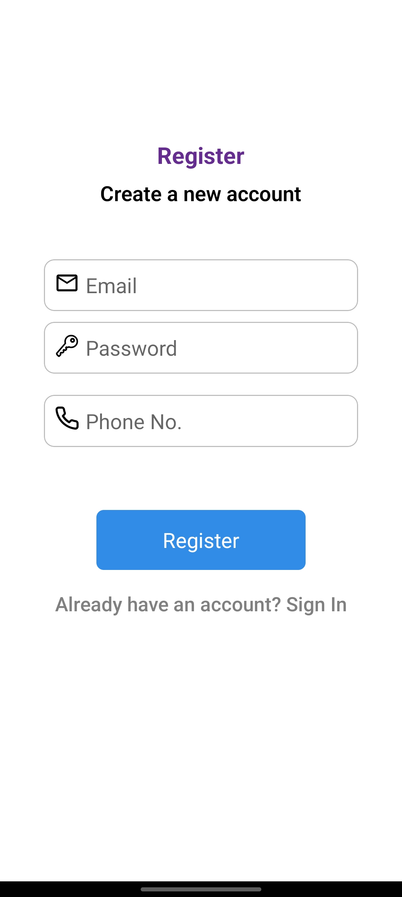
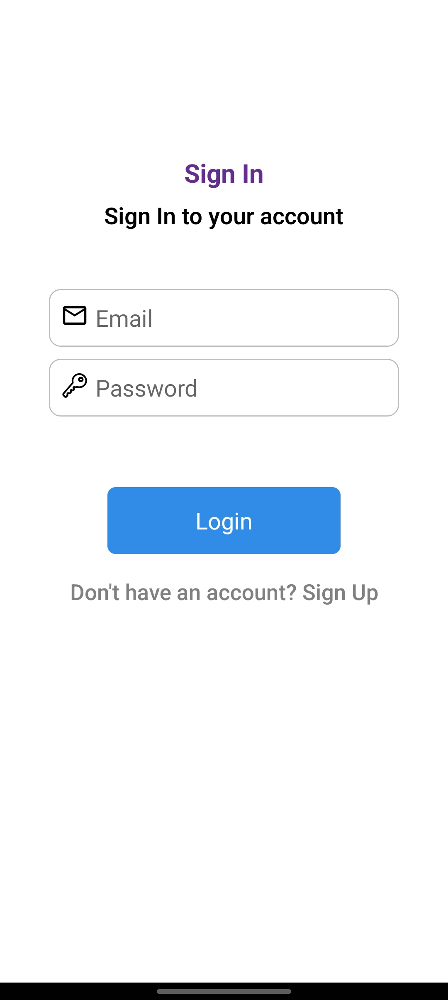
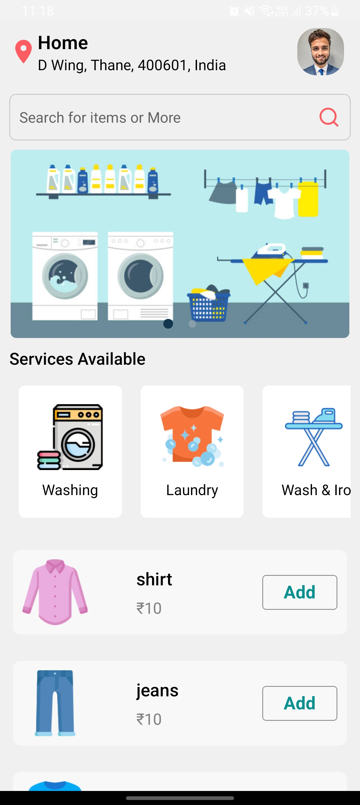
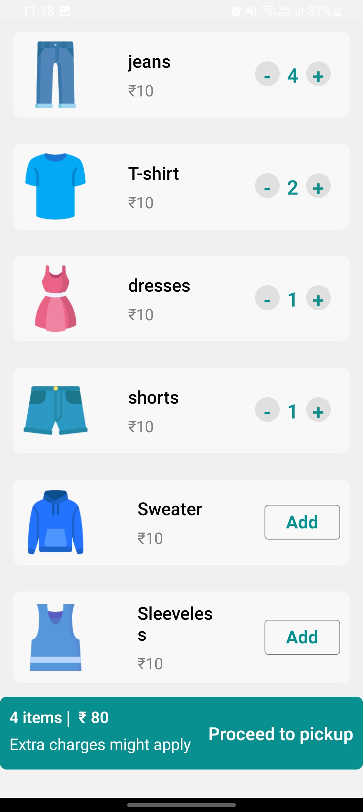
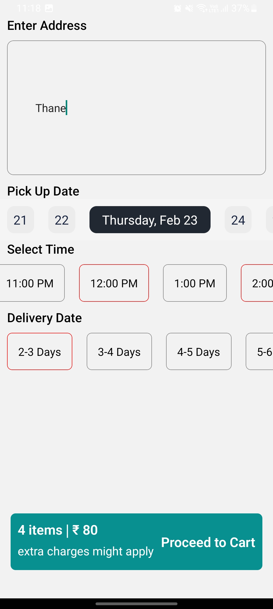
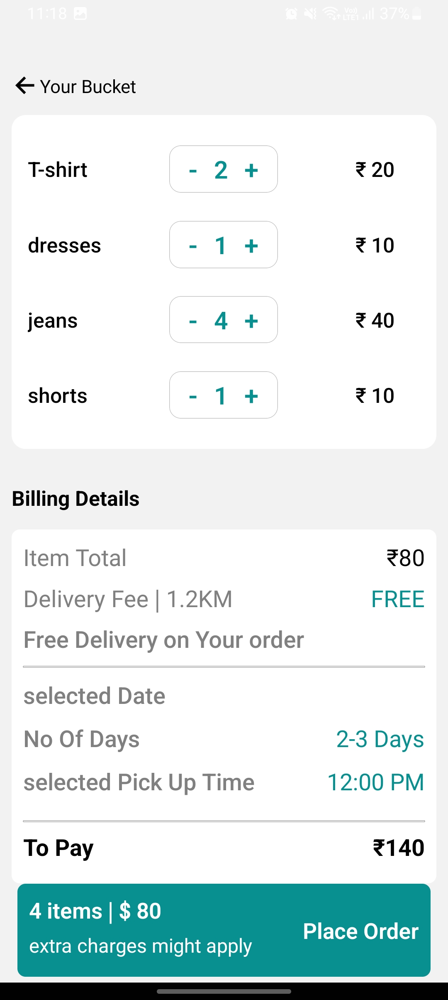
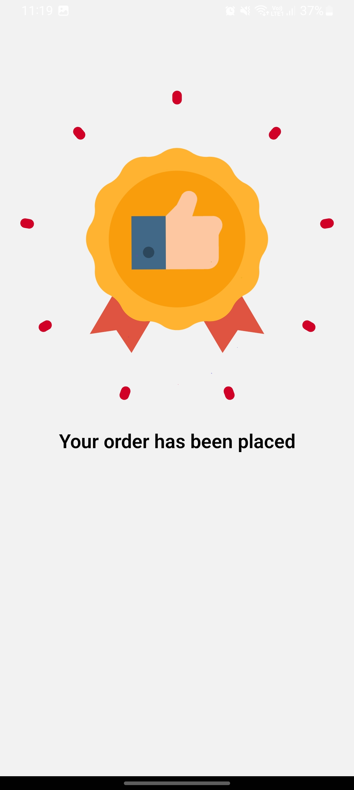

# LaundryEase

<p align="left">
  
</p>

LaundryEase is a convenient and user-friendly laundry application built with React Native, Firebase integration, Lottie animations, and more. This app simplifies the laundry process, providing features like sign-in, sign-up, profile management, intuitive item selection with a user-friendly cart system, pickup details, order placement, and even a location tracker.


## Installation

### APK Download
Download the latest version of the LaundryEase APK [here](https://github.com/rohanudhwani/LaundryEase/raw/master/LaundryEase.apk).


## Features

- **Firebase Integration:** Secure sign-in and sign-up functionality using Firebase authentication.
- **Profile Section:** Users can manage their profiles within the app.
- **Laundry Items:** A variety of laundry items such as shirts, dresses, etc., can be selected and added to the cart.
- **Intuitive Cart System:** Easy-to-use UI for adding items to the cart along with quantity adjustments.
- **Pickup Details:** Users can provide their pickup address, date, and time for added convenience.
- **Order Placement:** Seamless cart handling and order placement with updates stored in Firebase for each user.
- **Lottie Animations:** Enjoy a delightful animation when placing a successful order.
- **Location Tracker:** Automatically detect and display the user's location.

## GIFs
| Login Process | App Usage |
| --- | --- |
|  |  |
| Visual demonstration of the login and signup process | Overview of the app usage, including product selection and order placement |

## Screenshots
| SignUp | SignIn | Home | Order |
| --- | --- | --- | --- |
|  |  |  |  |
| Registration screen with email, password, and phone number fields | Login screen with email and password | Home screen showing user location and available products | Home screen with added products in the cart |

| Profile | Pickup Details | Cart | Placed Animation |
| --- | --- | --- | --- |
|  |  |  |  |
| User profile and sign-out option | Capture user's address, date, and time for laundry pickup | Final cart with billing information | Animation displayed after successfully placing an order |


## Getting Started

1. Clone the repository:
   ```bash
   git clone https://github.com/rohanudhwani/LaundryEase.git
   ```

2. Navigate to the project directory:
   ```bash
   cd LaundryEase
   ```

3. Install dependencies:
   ```bash
   npm install
   ```

4. Run the application:
   ```bash
   npx expo start
   ```

## Feedback and Contributions

Feel free to contribute or provide feedback by creating an issue or submitting a pull request. We welcome your suggestions to make LaundryEase even better!

---

**LaundryEase** - Making laundry a breeze!
